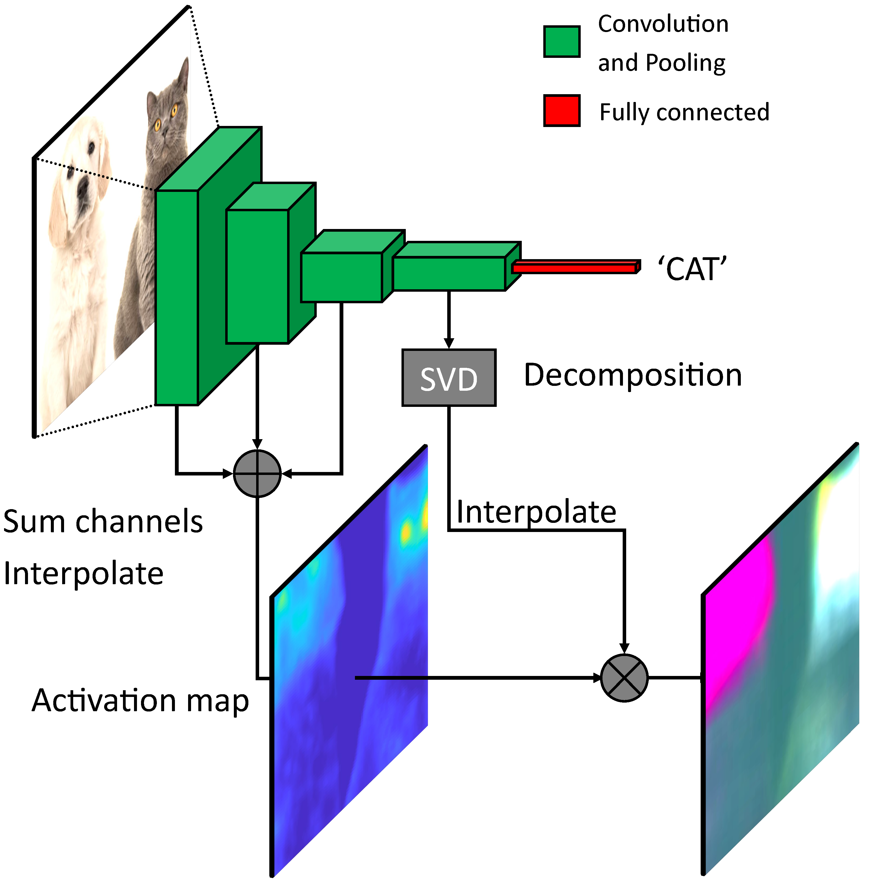
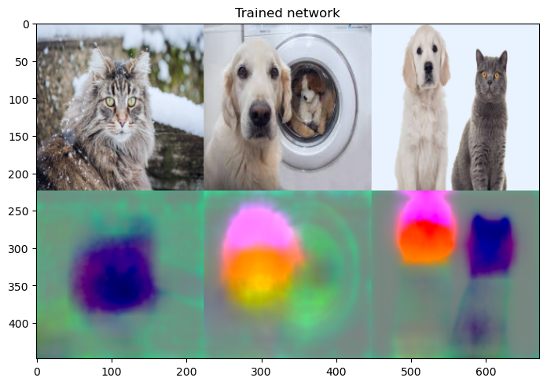
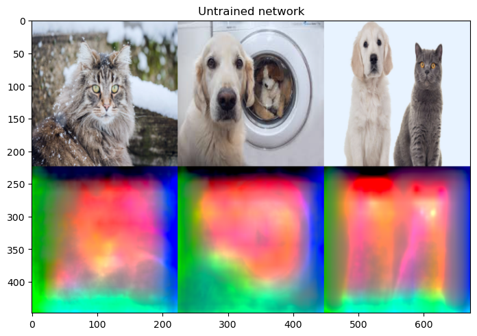

# Principal Feature Visualization (PFV)
Principal feature visualization is a visualization technique for convolutional
neural networks that highlights the contrasting features in a batch of images.
It produces one RGB heatmap per input image.



## Dependencies
* pytorch
* numpy

### Additional dependencies for the demo:
* torchvision
* matplotlib
* pillow

## Getting started
Install the dependencies listed above, and run the example in demo.py: `python demo.py`

## Example

A trained network shows good localization:



But an untrained (re-initialized) network shows scrambled output, as expected:



## The paper
This method was presented at ECCV 2020. Please see [the full paper](https://www.ecva.net/papers/eccv_2020/papers_ECCV/papers/123680018.pdf) and [supplementary material](http://www.ecva.net/papers/eccv_2020/papers_ECCV/papers/123680018-supp.pdf) for more information about our method.

If you find this useful, please cite:

```
@inproceedings{bakken2020principal,
  title={Principal Feature Visualisation in Convolutional Neural Networks},
  author={Bakken, Marianne and Kvam, Johannes and Stepanov, Alexey A and Berge, Asbj{\o}rn},
  booktitle={European Conference on Computer Vision},
  pages={18--31},
  year={2020},
  organization={Springer}
}
```

